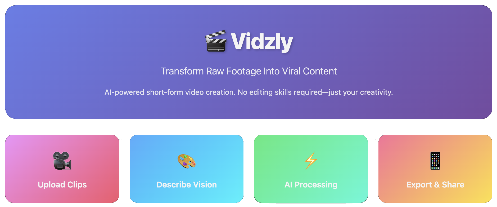

<p align="center">
  
</p>

# 🎬 Vidzly - Your AI-Powered Short Video Creator

> **Transform raw footage into viral-ready content in seconds. No skills required. No expensive gear needed. Just your vision and our AI.**

## ✨ What is Vidzly?

Vidzly is an intelligent automation platform that revolutionizes short-form video creation. Whether you're a micro-influencer, content creator, or business owner, Vidzly transforms your raw clips into polished, engaging 30-second videos that stop the scroll.

### 🚀 Why Vidzly?

- **Zero Learning Curve**: No video editing skills? No problem. Just upload and describe your vibe.
- **AI-Powered Magic**: Advanced AI handles cutting, transitions, music sync, and visual effects automatically.
- **Lightning Fast**: What takes hours in traditional editing software takes minutes with Vidzly.
- **Professional Quality**: Get studio-quality results without the studio price tag.
- **Your Style, Your Way**: Customize the mood, pace, and aesthetic to match your brand.

### 🎯 Perfect For

- 📱 Micro-influencers building their social media presence
- 🎨 Content creators who want to focus on creativity, not editing
- 💼 Small businesses creating marketing content
- 🎓 Educators making engaging educational clips
- 🎪 Anyone who wants to create stunning videos effortlessly

## 🎬 How It Works

1. **Upload Your Raw Footage** - Drop your clips, no matter how rough
2. **Describe Your Vision** - Tell us your vibe, mood, or style preferences
3. **AI Works Its Magic** - Our intelligent system edits, enhances, and polishes
4. **Download & Share** - Get your scroll-stopping 30-second masterpiece

## 🛠️ Features

- 🎞️ **Smart Auto-Editing**: Intelligent scene detection and cutting
- 🎵 **Music Synchronization**: Perfect beat-matching and audio enhancement
- 🎨 **Style Transfer**: Apply filters and effects that match your brand
- ⚡ **Real-Time Preview**: See your video come together as it's being created
- 📊 **Analytics Ready**: Optimized for maximum engagement

## 📅 Release Date

**Coming Soon: November 30, 2025**

Join us on this journey to democratize video creation and empower creators everywhere!

## Setup

This project uses [Poetry](https://python-poetry.org/) for dependency management.

### Installing Poetry

If you don't have Poetry installed, you can install it using:

```bash
curl -sSL https://install.python-poetry.org | python3 -
```

Or on macOS with Homebrew:

```bash
brew install poetry
```

### Installing Dependencies

Once Poetry is installed, install the project dependencies:

```bash
poetry install
```

This will create a virtual environment and install all dependencies specified in `pyproject.toml`.

### Activating the Virtual Environment

To activate the Poetry virtual environment:

```bash
poetry shell
```

Alternatively, you can run commands within the virtual environment without activating it:

```bash
poetry run <command>
```

### Adding Dependencies

To add a new dependency:

```bash
poetry add <package-name>
```

To add a development dependency:

```bash
poetry add --group dev <package-name>
```

### Removing Dependencies

To remove a dependency:

```bash
poetry remove <package-name>
```

### Updating Dependencies

To update all dependencies to their latest compatible versions:

```bash
poetry update
```

### Setting Up Environment Variables

Create a `.env` file in the root directory and add your environment variables.

```bash
GOOGLE_API_KEY=your_google_api_key
ELEVENLABS_API_KEY=your_elevenlabs_api_key
```

### Running the Application

```bash
poetry run python src/app/app.py
```

## Adding a New MCP Tool

For detailed instructions on how to add a new MCP tool to the application, see [ADDING_MCP_TOOLS.md](ADDING_MCP_TOOLS.md).

### Contributors

- 🐱 [honghanhh](https://github.com/honghanhh)🐱
- 🦊 [nvti](https://github.com/nvti)🦊
- 🐻 [Nlag](https://github.com/NLag)🐻
- 🐰 [DaphneeCh](https://github.com/DaphneeCh)🐰
